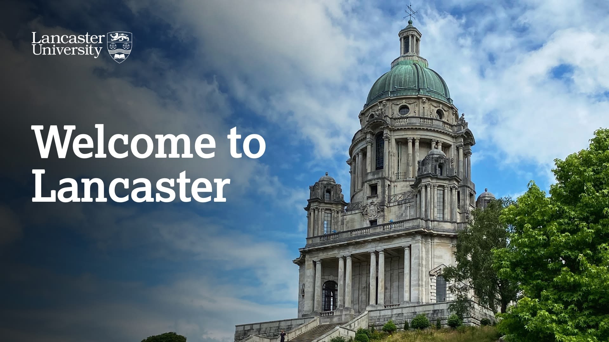

---
# Feel free to add content and custom Front Matter to this file.
# To modify the layout, see https://jekyllrb.com/docs/themes/#overriding-theme-defaults

layout: default_sidebar
title: Home 
---

The British Machine Vision Conference (BMVC) is the British Machine Vision Association's (BMVA) annual conference on machine vision, image processing, and pattern recognition. It is one of the major international conferences on computer vision and related areas held in the UK. With increasing popularity and quality, it has established itself as a prestigious event on the vision calendar.

 

    
<strong>BMVC 2025 conference and workshop proceedings are now online!</strong> You can found them at: <a href="https://bmvc2024.org/proceedings/conference-proceedings/">[Conference]</a> and <a href="https://bmvc2024.org/proceedings/workshop-proceedings/">[Workshops].</a>
 -->
    
Glasgow Convention Bureau has negotiated <strong>discounted rates with a wide range of hotels</strong>. More information at: <a href="{{ site.baseurl }}">[link]</a>

    
<strong>The list of accepted papers is now avialable at: <a href="{{ site.baseurl }}">[link]</a></strong>

    
<strong>BMVC will not have a rebuttal period this year!</strong> Further guidance for authors, reviewers and area chairs can be found in the Authors dropdown menu above.

    
<strong>Follow us on Twitter</strong> (<i class="fab fa-twitter fa-1x" style="color: gray;"></i> <a href="https://twitter.com/{{ site.twitter_username }}" style="color:#b5121b">{{ site.twitter_username }}</a>) for real-time updates about deadlines, the venue and the city! 

    
BMVC'24 will be held in  at the <a href="https://www.sec.co.uk/">Scottish Event Campus</a>!

 

    <!-- 
Paper registeration deadline is 23:59 GMT Tuesday, 13 May 2025. Full paper submission deadline is 23:59 GMT Friday, 16 May 2025. 
 -->
    
Top papers from BMVC 2026 will be invited to submit extended versions to a special issue of the International Journal of Computer Vision (IJCV). 

    <!--  
The submission portal is alive. <a href="https://openreview.net/group?id=bmva.org/BMVC/2025/Conference">OpenReview Link</a> 
 -->
    <!--
BMVC will not have a rebuttal period this year. Further guidance for authors, reviewers and area chairs can be found in the Authors dropdown menu above.
-->
    
Follow us on Twitter (<i class="fab fa-twitter fa-1x" style="color: gray;"></i> <a class="a-dbg" href="https://twitter.com/BMVCconf">BMVCconf</a>) for real-time updates about deadlines, the venue and the city. 

    
BMVC'26 will be held in Lancaster. 

    

 
## Call for Area Chairs and Reviewers

We're seeking motivated Area Chairs and dedicated Reviewers! Self-nominate in the following links!

* Area Chairs: <a href="https://forms.gle/Jr3ysR6SePgr1vGW8">Call for Area Chairs Form</a>
* Reviewers: <a href="https://forms.gle/UwvuHkbRtJZrptzw6">Call for Reviewers Form</a>

## Call for Papers
 

 

The 36th BMVC will be held from 24th - 27th November 2025. We invite papers to be submitted for the conference and ask that potential authors read the call for papers that details the topics of interest for the conference.

    

    

        
<a class="btn btn-primary" role="button"  href="https://openreview.net/group?id=bmva.org/BMVC/2025/Conference">Submit your Paper</a>

    

    

        
<a class="btn btn-primary" role="button" href="{{site.baseurl}}">Call for Papers</a>

    

    

        
<a class="btn btn-primary" role="button" href="{{site.baseurl}}">Timeline</a>

    

    

        
<a class="btn btn-primary" role="button" href="{{site.baseurl}}">Author Guidelines</a>

    
 

 

## About the BMVC

The British Machine Vision Conference is organised by <a href="https://britishmachinevisionassociation.github.io/">The British Machine Vision Association and Society for Pattern Recognition</a> for the purposes of the scholarly advancement of education and research in machine vision, pattern recognition and associated academic research areas, including the application of such scholarly research within industry. The Association is a Company limited by guarantee, No.2543446, and a non-profit-making body, registered in England and Wales as Charity No.1002307 (Registered Office: Dept. of Computer Science, Durham University, South Road, Durham, DH1 3LE, UK).

<link rel="stylesheet" href="https://unpkg.com/photo-sphere-viewer@5/dist/photo-sphere-viewer.css">

